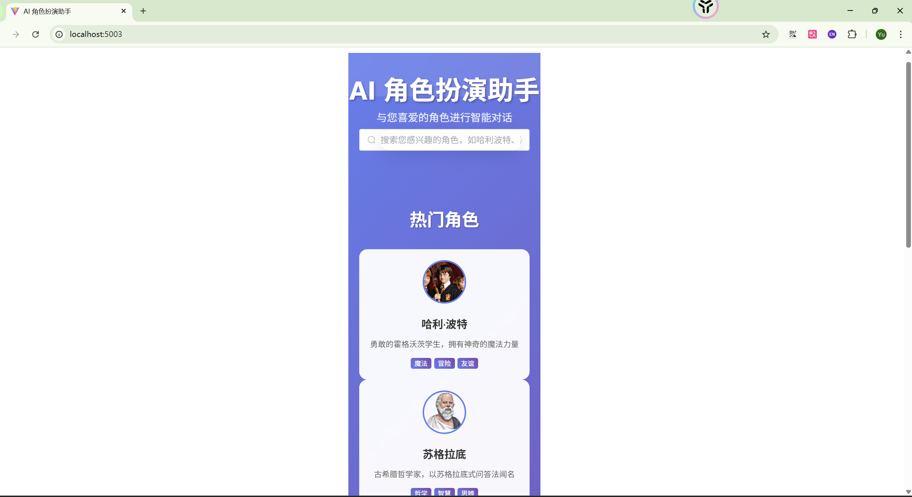
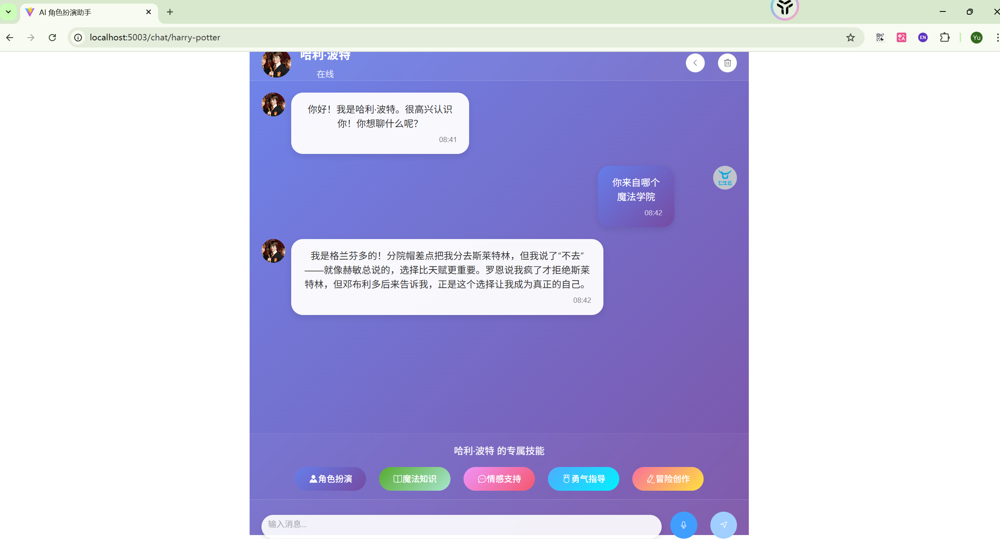

# 🎭 AI角色扮演聊天应用 (Qny)

> 与历史名人和文学角色进行沉浸式语音对话的AI应用
>
 



## ✨ 项目特色

- 🎯 **6位经典角色**：哈利波特、苏格拉底、夏洛克、爱因斯坦、莎士比亚、孔子
- 🗣️ **语音对话**：支持语音识别和高质量TTS语音合成（优先男性语音）
- 🧠 **智能交互**：基于AI大模型的深度角色扮演和个性化回复
- 🎪 **专属技能**：每个角色都有5+个专业技能（魔法教学、哲学思辨、推理分析等）
- 📱 **响应式设计**：完美适配PC端和移动端
- 💾 **对话记忆**：智能保存和管理对话历史

## 🏗️ 技术架构

### 前端
- **Vue 3** + TypeScript + Vite
- **Element Plus** UI框架
- **Web Speech API** 语音识别
- **Edge-TTS** + 浏览器TTS 语音合成

### 后端  
- **Spring Boot 3** + Java 17
- **LangChain4j** AI集成框架
- **MongoDB** 对话存储
- **WebFlux** 响应式编程

## 🚀 快速开始

### 环境要求
- Node.js 18+
- Java 17+  
- Maven 3.8+
- MongoDB 4.4+

### 1. 克隆项目
```bash
git clone <repository-url>
cd Qny
```

### 2. 配置环境变量
```bash
# 后端配置 (backend/src/main/resources/application.yaml)
langchain4j:
  open-ai:
    streaming-chat-model:
      api-key: ${ALI_KEY}
      base-url: https://dashscope.aliyuncs.com/compatible-mode/v1
      model-name: qwen-plus
    embedding-model:
      api-key: ${ALI_KEY}
      base-url: https://dashscope.aliyuncs.com/compatible-mode/v1
      model-name: text-embedding-v3

spring:
  data:
    mongodb:
      uri:  mongodb://localhost:27017/qny_chat_memoey
```

### 3. 启动后端服务
```bash
cd backend
mvn spring-boot:run
```

### 4. 启动前端服务
```bash
cd frontend
pnpm install
pnpm run dev
```

### 5. 访问应用
打开浏览器访问：http://localhost:5003

## 🎯 角色与技能

| 角色 | 专属技能 | 特色 |
|------|----------|------|
| 🪄 **哈利波特** | 魔法咒语、霍格沃茨导览、魔法生物、魔法历史、魁地奇 | 魔法世界探索 |
| 🤔 **苏格拉底** | 苏格拉底式问答、哲学思辨、古希腊文化、智慧格言、道德分析 | 哲学启发思考 |
| 🔍 **夏洛克** | 推理分析、案例分析、观察技巧、记忆宫殿、犯罪心理学 | 逻辑推理训练 |
| 🌌 **爱因斯坦** | 相对论科普、物理实验、科学发现、数学解答、宇宙探索 | 科学知识普及 |
| 📝 **莎士比亚** | 诗歌创作、作品赏析、爱情哲学、文艺复兴、修辞技巧 | 文学艺术指导 |
| 📖 **孔子** | 论语讲解、教育智慧、儒家伦理、治国思想、人际指导 | 传统文化传承 |

## 🎵 语音功能

### 语音识别
- **实时识别**：基于Web Speech API的实时语音识别
- **中文优化**：针对中文语音识别进行优化
- **噪音处理**：智能过滤背景噪音

## 📁 项目结构

```
Qny/
├── frontend/                 # Vue3前端项目
│   ├── src/
│   │   ├── views/           # 页面组件
│   │   ├── services/        # 服务层（语音、API）
│   │   ├── stores/          # 状态管理
│   │   └── components/      # 通用组件
│   └── package.json
├── backend/                 # Spring Boot后端项目  
│   ├── src/main/java/com/ony/
│   │   ├── controller/      # 控制器层
│   │   ├── service/         # 服务层
│   │   ├── config/          # 配置类
│   │   └── bean/           # 数据模型
│   │   └── store/           # 存储模块
│   └── pom.xml
├── md/                      # 角色描述文档
├── 说明一.md               # 详细产品说明文档
└── README.md               # 项目说明
```

## 🔧 开发与配置

### API接口
- **聊天接口**: `POST /qny/chat` - 流式响应

### 故障排除
- **听不到语音**：检查浏览器音频权限和语音设置
- **AI不回复**：检查OpenAI API配置和网络连接
- **MongoDB连接失败**：确认MongoDB服务已启动

### 测试语音
在浏览器控制台运行：
```javascript
voiceService.testCurrentVoice()  // 测试当前语音配置
```

---

**开始你的AI角色扮演之旅吧！** 🎉

*更多详细信息请查看 [说明一.md](说明一.md)*